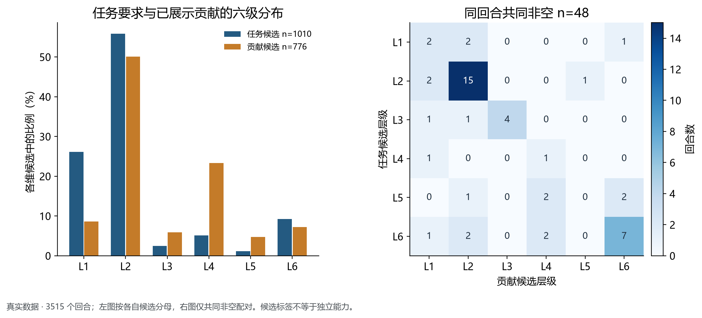
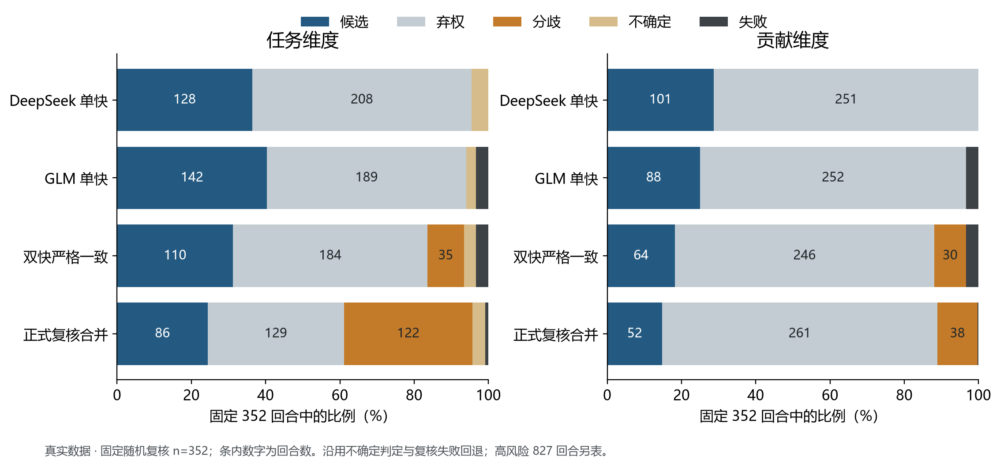
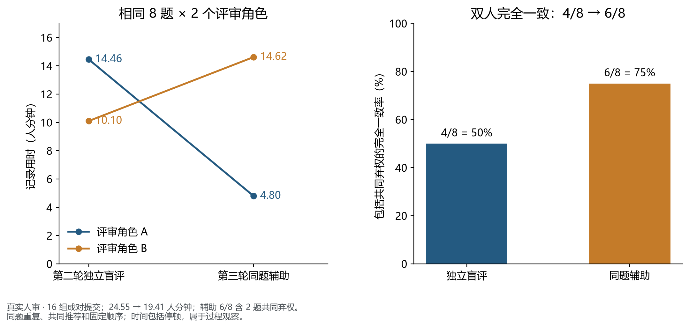
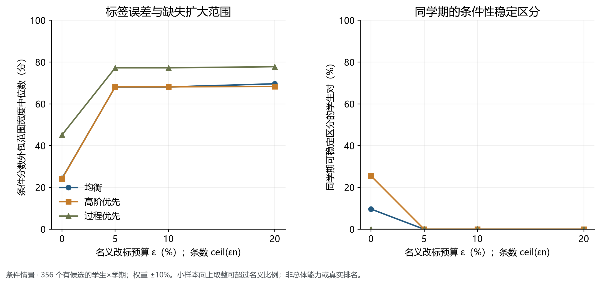

# 南行 · AI 辅助学习的增量价值评价

**把任务要求、学生贡献与评价不确定性连接起来，让教学建议有可核查的依据。**

学习平台保存了提问、回复和工具使用记录。我们研究这些资料能支持怎样的认知评价，并把证据缺口、模型分歧与指标的可操纵性传递到最终的报告动作。

| 从这里开始 | 可以看到什么 |
| --- | --- |
| [论文 PDF](build/paper/main.pdf) · [论文源码](paper/main.tex) | 资料 → A 测量 → B 可比性 → C 指标 → D 检验反馈 → E 决策 |
| [Notebook 导读](notebooks/README.md) · [已执行页面](build/notebooks/index.html) | 真实观察、条件分析与合成实验的计算过程 |
| [演示与讲稿](slides/README.md) | 研究故事、AI 工作流、实际发现及答问证据 |
| [测评工作台](https://math.hnnu.team) · [本地合成示例](workbench/README.md) | 资料、评审、争议核查与报告的交互入口 |
| [离线运行说明](docs/复现说明.md) | 合成案例、汇总结果验证与授权资料复算 |

## 一条带反馈的建模链


三项贡献分别落实到可检查的结果：

1. **连接任务、贡献与不确定性。** 两维候选分别统计；只有同一回合都存在候选，才进行配对比较。缺失标签继续进入总体范围分析。
2. **组织多模型与人机协作评审。** 独立判断、随机复核、高风险复核和真人辅助复评保留各自的条件、分母及记录。
3. **用反例改变指标的使用。** 工具堆叠、分布贴合和权重扰动用于确定何时给范围、核查争议、补充证据或暂缓比较。

## 主要发现

冻结记录包含 **3,515 个真实回合、401 个学生—学期单位**。模型最终提供 1,010 个任务候选与 776 个贡献候选；两类候选的选择机制和覆盖不同。

| 观察量 | 任务要求 | 学生贡献 | 解释范围 |
| --- | ---: | ---: | --- |
| 候选覆盖 | 28.73% | 22.08% | 分母均为 3,515 个真实回合 |
| 候选内高阶占比 | 15.54% | 35.31% | 分母分别为 1,010、776，不能据边际差异推出同一学生的贡献更高 |
| 同回合双候选 | 48 | 48 | 任务较高 13、相同 29、贡献较高 6 |



固定随机复核的 **352 回合**构成同条件流程比较；高风险 827 回合单列。覆盖、弃权和判断改变用于解释组件作用；标注准确性仍需适用的独立参考。



真人探索包含 **16 对同题、同评审角色记录**。独立评审到 AI 辅助复评的记录时间从 24.55 到 19.41 人分钟；两名评审的变化方向不同。固定顺序、重复题目与共享建议共同限制了因果解释。



逐回合时间戳的实际可用数为 0，严格时间有序关联的合格记录为 0。B 问据此报告分层观察及选择性缺失范围。C 问对 356 个有任务候选的学生—学期单位求条件范围；缺失 CTQ 和工具信息保留为未知，完整 AIV 可用数为 0。



数值、分母和来源哈希统一见 [结果清单](results/final-analysis/summary.json)。[结果阅读指南](docs/结果阅读指南.md)将每项发现对应到图表、计算入口与教学动作。

## 理解 AI 解题过程

[AI 解题过程](docs/AI解题过程.md)说明资料清洗、文献回查、提示结构、多模型探索、人工介入及 ChatGPT 生图的采用依据。探索与失败修正在对应 Notebook 和论文附录中保留。

## 运行两个案例

在项目环境中执行：

```powershell
.venv\Scripts\python.exe -X utf8 -B scripts/demo_evidence_chain.py
```

第一个案例从保存的**合成标签**实际计算五项指标与解释；第二个案例移除会话和工具证据，展示停止计算的指标、条件范围及补采提示。两例均无需实时模型响应。

完整运行和输入字段见 [复现说明](docs/复现说明.md)。公共资料支持合成实验与已发布汇总表的验证；从逐回合冻结记录重新生成全部真实统计需要相应数据授权。

## 阅读与复用

| 目录 | 内容 |
| --- | --- |
| `aiv/`、`tests/` | 指标、模型协议、统计与针对性检查 |
| `scripts/` | 离线计算、结果生成与复现入口 |
| `notebooks/` | 十本可执行的研究说明 |
| `results/final-analysis/` | 汇总表、结果清单与研究图 |
| `paper/`、`slides/` | 论文与演示材料 |
| `examples/` | 合成输入和已保存的合成模型响应 |

原创代码采用 MIT；原创文稿与图表采用 CC BY 4.0。第三方资源按各自许可使用，见[许可范围](LICENSES.md)。原始竞赛资料、学生记录和凭据在授权研究环境中保管。
