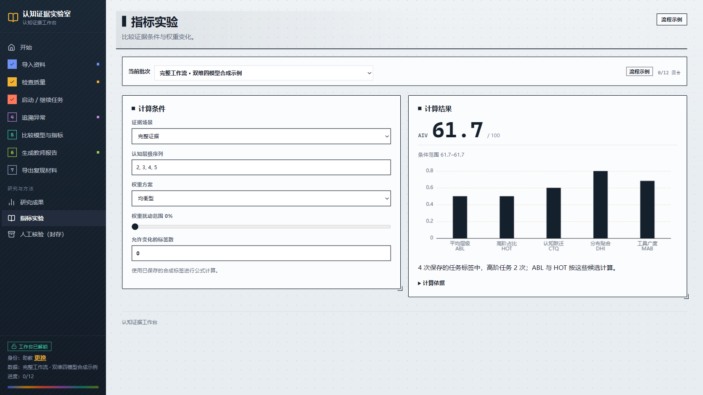
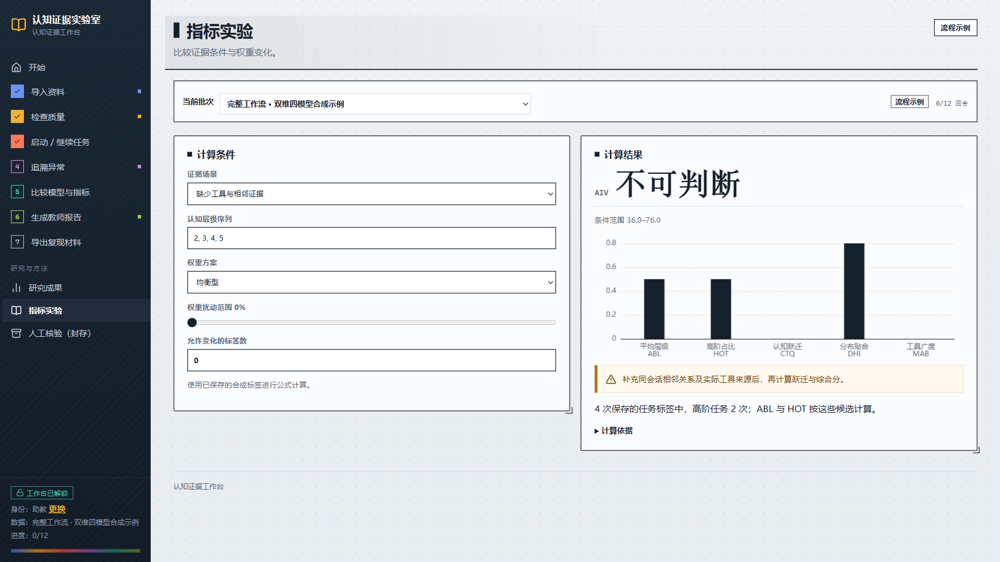
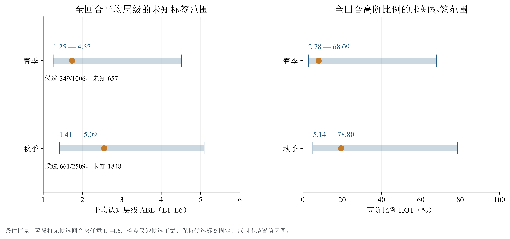

# 南行 · AI 辅助学习的增量价值评价

**从学习过程中的证据出发，区分任务要求与学生贡献，让评价走向可核查的教学行动。**

[论文 PDF](build/paper/main.pdf) · [20 页路演](slides/README.md) · [Notebook](notebooks/README.md) · [运行指南](docs/复现说明.md) · [体验工作台](https://math.hnnu.team)


学习平台记录了提问、回复和工具使用，但这些记录能支持多强的评价？南行把认知标注、比较条件、指标范围、反例检验和教师报告连在一起，保留证据缺口与判断分歧。

| 研究资料 | 双维测量 | 同条件复核 | 实际可计算范围 |
| --- | --- | --- | --- |
| **3,515** 个真实回合 | **1,010 / 776** 个任务 / 贡献候选 | **352** 个固定随机回合 | **356** 个学生—学期的条件评分范围 |
| 来自 **401** 个学生—学期单位 | 同回合双候选 **48** 条 | 高风险 **827** 回合另列 | 完整 AIV 可用数 **0** |

## 选择你的入口

| 想做什么 | 从哪里开始 | 你会得到什么 |
| --- | --- | --- |
| 看研究结论 | [论文](build/paper/main.pdf) → [结果阅读指南](docs/结果阅读指南.md) | 五组统计图、分母、条件与解释 |
| 看完整演示 | [路演图页与讲稿](slides/README.md) | 12 页主讲、7 页备答、1 页致谢 |
| 动手复算 | [Notebook 导读](notebooks/README.md) → [00 总览](notebooks/00_论文材料总览.ipynb) | 十本已执行 Notebook、合成案例和公开汇总验证 |
| 体验教学流程 | [在线工作台](https://math.hnnu.team) · [本地运行](workbench/README.md) | 资料导入、模型判断、争议核查和报告 |
| 复用方法与代码 | [复现说明](docs/复现说明.md) · [指标定义](docs/指标定义与性质.md) | 输入要求、计算入口、依赖与迁移方式 |

GitHub 可直接浏览 Notebook 中保存的图表；下载仓库后，可在浏览器打开 [离线图文目录](build/notebooks/index.html) 和 [路演播放器](slides/roadshow/player/index.html)。

## 从证据到行动


| 环节 | 要解决的问题 | 可检查的实现 |
| --- | --- | --- |
| **A · 测量** | 提问需要什么认知活动？学生实际展示了什么？ | 两维独立标注、多模型复核、同题人工比较 |
| **B · 比较** | 数据是否支持把变化归因于 AI？ | 时间顺序、处理定义、可比人群与缺失条件 |
| **C · 指标** | 证据不足时怎样报告分数？ | 五维指标、未知项范围、权重与标签敏感性 |
| **D · 检验** | 增加工具或贴合目标分布能否操纵分数？ | 合成反例与规则修正 |
| **E · 行动** | 教师下一步应核查什么、补充什么？ | 证据摘要、争议提示和补采建议 |

AI 独立判断、随机复核、高风险复核和真人辅助复评的角色与条件见 [AI 解题过程](docs/AI解题过程.md)。

## 先运行两个案例

需要 **Python 3.13**。在仓库根目录创建环境并安装锁定依赖：

```powershell
python -m venv .venv
.venv\Scripts\python.exe -m pip install -r requirements-lock.txt
.venv\Scripts\python.exe -X utf8 -B scripts/demo_evidence_chain.py
```

macOS / Linux 将 `.venv\Scripts\python.exe` 换成 `.venv/bin/python`。这两个案例使用已保存的**合成标签**，离线运行，无需 API 密钥或 TeX。

| 完整证据 | 缺失会话和工具证据 |
| --- | --- |
|  |  |
| 五项指标可计算，均衡分约 **61.65** | CTQ、MAB 和点分为 `null`；条件范围 **36–76** |
| 阅读已观测证据与行动建议 | 查看需要补充的相邻关系和工具来源 |

接着可执行十本 Notebook；图表需要 **SimSun 和 Times New Roman**，环境要求及其他复算方式见 [复现说明](docs/复现说明.md)。

```powershell
.venv\Scripts\python.exe -X utf8 -B scripts/execute_notebooks.py --workers 1
```

## 结果怎样读

### 任务要求与学生贡献：先核对共同样本


任务、贡献的候选覆盖分别为 **28.73%** 和 **22.08%**，分母均为 3,515。候选内高阶占比分别为 15.54% 和 35.31%，使用各自的 1,010、776 个候选作为分母。**同回合双候选只有 48 条**：任务较高 13 条、相同 29 条、贡献较高 6 条。两维边际占比不能替代同回合比较。

### 缺失标签：把未知保留在范围中



无候选回合仍属于总体。将未知标签取为 L1–L6，得到上图的条件范围；候选子集点值与总体范围各用自己的分母。逐回合时间戳可用数为 0，严格时间有序关联的合格记录为 0，当前结果支持分层观察及条件分析。

### 流程、人审与稳健性：继续核查三组结果

| 结果图 | 观察与解释 | 计算入口 |
| --- | --- | --- |
| [随机复核流程](results/final-analysis/fig02_random_flow.png) | 同一组 352 回合比较输出状态；候选变化不等于准确率变化 | [02 标注与互评](notebooks/02_标注与互评.ipynb) |
| [同题人工复评](results/final-analysis/fig04_human_pairs.png) | 16 对同题同角色记录，24.55 → 19.41 人分钟；两位评审方向不同，固定顺序等条件限制因果解释 | [03 人审与校准](notebooks/03_人审与校准.ipynb) |
| [标签与权重敏感性](results/final-analysis/fig05_score_sensitivity.png) | 356 个有任务候选的学生—学期单位；缺失 CTQ 和工具信息保留为未知 | [05 指标与不确定性](notebooks/05_指标性质与不确定性.ipynb) |

五组图的 PNG、PDF、SVG、输入表及计算说明见 [结果阅读指南](docs/结果阅读指南.md)；数值与来源版本见 [结果清单](results/final-analysis/summary.json)。

## 复用与许可

| 目录 | 内容 |
| --- | --- |
| [`aiv/`](aiv/) · [`tests/`](tests/) | 指标、判断协议、统计与计算检查 |
| [`scripts/`](scripts/) · [`examples/`](examples/) | 复算入口、合成输入和保存的合成响应 |
| [`notebooks/`](notebooks/) | 十本可执行研究说明 |
| [`results/final-analysis/`](results/final-analysis/) | 公开汇总表、来源清单与论文图 |
| [`paper/`](paper/) · [`slides/`](slides/) | 论文源稿、演示图页与讲稿 |
| [`workbench/`](workbench/) | 本地工作台与合成示例 |

公开材料支持合成实验和已发布汇总表的验证；从逐回合冻结记录重新生成真实统计需要相应数据授权。原始竞赛资料、学生记录及凭据在授权研究环境中保管。

原创代码采用 **MIT**；原创文稿与图表采用 **CC BY 4.0**。第三方资源按各自许可使用，见 [许可范围](LICENSES.md)。
