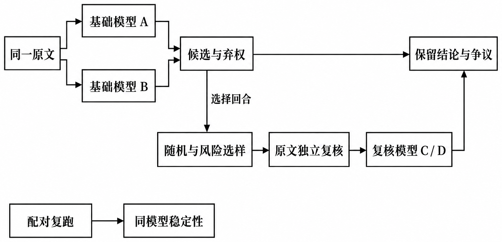

# AI 怎样参与分析，结论怎样接受核查

AI 辅助资料整理、候选认知判断、代码实现与图文表达。研究者确定测量对象、核对证据与公式，并决定结果的解释和采用范围。

## 从原文到候选判断

正式 t3 分析由两个基础模型独立判断 **3,515** 个真实回合的任务要求与已展示贡献；两个强模型分别复核固定随机 **352** 回合和高风险 **827** 回合。复核首次判断只读取原文与规则。弃权、分歧、失败及回退状态保留在结果中，随机与风险子集分别报告。

| 环节 | AI 产物 | 采用前怎样检查 | 可查入口 |
| --- | --- | --- | --- |
| 文档与问答整理 | 文本、图像内容和回合结构 | 来源位置、文件摘要、角色边界与结构推断 | [Notebook 01](../notebooks/01_数据与问题.ipynb)、[回合处理](../aiv/turns.py) |
| 文献与方法 | 检索线索、摘要、论证草稿 | 回到作者原文、公式、页码与 DOI | [参考文献](../paper/references.bib)、[论文](../paper/研究论文.md) |
| 候选认知编码 | L1–L6 标签、连续引文、理由或弃权 | 字段和取值、引文匹配、语义依据、来源连接 | [Notebook 02](../notebooks/02_标注与互评.ipynb)、[正式协议](../aiv/fast_strong_workflow.py) |
| 正式批量复核 | 同题多模型判断与状态变化 | 固定样本、统一分母、随机与风险分层、配对复跑 | [Notebook 09](../notebooks/09_Agent批量结果与互评.ipynb) |
| 人工辅助复评 | 同题建议与四段式说明 | 人工修改、采纳、弃权和评审差异 | [Notebook 03](../notebooks/03_人审与校准.ipynb) |
| 计算与可视化 | 指标实现、范围、统计图与说明图 | 数学性质、冻结输入、结果分母、逐图核对 | [Notebook 导读](../notebooks/README.md)、[检验代码](../tests/)、[路演](../slides/README.md) |

原文匹配检查引文位置；认知标签还需检查语义。模型间一致、推荐采纳和独立准确率使用不同的证据与分母。

## 探索如何改变正式方法

| 观察到的问题 | 方法与报告的调整 |
| --- | --- |
| 12 题预实验中的独立判断、互评和仲裁会改变候选 | 真实 6 题与合成 6 题分别保留；正式 t3 使用固定规则与同样本比较，避免混用早期条件 |
| 两位评审查看共同 AI 建议后，耗时方向不同 | 同时展示总体与个人变化，保留共同弃权；按固定顺序的流程观察解释 |
| 工具堆叠能够提高分数 | 增加 MAB 权重置零的组件消融，同时说明失去工具广度奖励的取舍 |
| 匹配目标分布可让 DHI 达到 1 | 将其用于分布诊断，并要求独立证据支持学习进步解释 |
| 可靠逐回合时间戳缺失 | 保留学期分层描述、未知标签范围与补采字段，时间有序关联资格计数为 0 |

具体模型标识、工具用途、试错与人工采用过程见[论文 AI 使用附录](../paper/appendix_ai_usage.tex)。统计图由计算代码生成；说明性插图与路演图页使用图像生成及本地排版，按各图来源清单核查。

## 继续核查

- 看结论与分母：[结果阅读指南](结果阅读指南.md)。
- 执行合成案例、Notebook 和图表重绘：[复现说明](复现说明.md)。
- 查生产判断及合并规则：[fast_strong_workflow.py](../aiv/fast_strong_workflow.py)。
- 查聚合版本与方法条件：[summary.json](../results/final-analysis/summary.json)。

公开材料包含汇总结果、合成示例和原创图表。逐条学生原文与评审记录保留在授权环境中。
