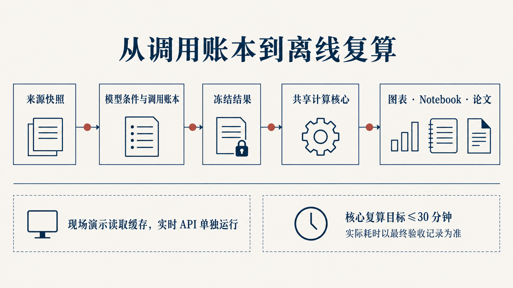

# Notebook · 阅读与复算

[返回项目首页](../README.md) · [运行指南](../docs/复现说明.md) · [结果阅读指南](../docs/结果阅读指南.md)

从一组学习记录出发，检查任务与贡献怎样测量、数据能支持什么比较，以及证据不足时怎样形成教学建议。十本 Notebook 保留运行后的图表，可直接在 GitHub 阅读；下载仓库后可打开 [离线图文目录](../build/notebooks/index.html)。



## 先选一条阅读路线

| 你的目标 | 建议顺序 | 重点 |
| --- | --- | --- |
| 快速了解研究 | [00 总览](00_论文材料总览.ipynb) → [09 真实结果](09_Agent批量结果与互评.ipynb) → [07 报告](07_教育报告与复用.ipynb) | 结果、证据边界与应用 |
| 复算完整方法 | 00 → 01 → 08 → 02 → 09 → 03 → 04 → 05 → 06 → 07 | 从数据到测量、条件分析、反例和行动 |
| 检查关键结论 | [02 流程比较](02_标注与互评.ipynb) · [03 人工复评](03_人审与校准.ipynb) · [05 条件范围](05_指标性质与不确定性.ipynb) | 同条件比较、分母、敏感性 |

## 从干净内核运行

使用 Python 3.13 和根目录的 `requirements-lock.txt`。图表需要 SimSun 与 Times New Roman；字体检查和安装环境说明见 [运行指南](../docs/复现说明.md)。

```powershell
# 在仓库根目录执行，逐本运行并保存结果
.venv\Scripts\python.exe -X utf8 -B scripts/execute_notebooks.py --workers 1

# 或打开 JupyterLab，选 Python 内核，再使用 Restart Kernel and Run All Cells
.venv\Scripts\python.exe -m jupyterlab
```

macOS / Linux 使用 `.venv/bin/python`。批量执行器使用启动命令对应的 Python 内核，每本从干净状态开始；结果写回 Notebook，HTML 和执行记录保存在 `build/notebooks/`。执行过程离线，无需模型 API 密钥或 TeX。

只想先确认计算环境，可运行 `.venv\Scripts\python.exe scripts/demo_evidence_chain.py`，查看完整证据和缺失证据两例；这一步无需绘图字体。需要重绘论文版式图时，再按 [高保真复算说明](../docs/复现说明.md)运行 `scripts/reproduce.py`。

## 各本回答什么

| Notebook | 你可以检查什么 | 输入 |
| --- | --- | --- |
| [00 论文材料总览](00_论文材料总览.ipynb) | 研究链、主要结果与计算入口 | 方法索引、公开汇总 |
| [01 数据与问题](01_数据与问题.ipynb) | 观测单位、字段缺失与合成分布 | 固定种子合成样本 |
| [08 真实数据与封存记录](08_真实数据与封存记录.ipynb) | 真实资料范围、字段条件、来源版本 | 汇总资料；原始输入需授权 |
| [02 标注与互评](02_标注与互评.ipynb) | 前置探索、352 个同题回合的流程与状态变化 | 合成实验、真实聚合 |
| [09 Agent 批量结果与独立复核](09_Agent批量结果与互评.ipynb) | 覆盖、六级分布、学生等权结果与 48 条双候选 | 真实聚合 |
| [03 人审与校准](03_人审与校准.ipynb) | 校准实验、16 对同题同角色记录的时间与一致性 | 合成实验、人审观察 |
| [04 识别边界与模拟](04_识别边界与模拟.ipynb) | 混杂模拟、时间顺序与前瞻样本条件 | 合成实验、真实字段检查 |
| [05 指标性质与不确定性](05_指标性质与不确定性.ipynb) | 五维指标、未知标签、改标预算和权重敏感性 | 合成实验、条件范围 |
| [06 红队与失败边界](06_红队与失败边界.ipynb) | 工具堆叠、文本扰动与目标匹配 | 合成反例、条件检验 |
| [07 教育报告与复用](07_教育报告与复用.ipynb) | 完整证据与缺证案例的指标、范围和建议 | 保存的合成标签 |

## 读图时保留的三个区别

- **真实观察**：3,515 个真实回合、401 个学生—学期；任务候选 1,010 个，贡献候选 776 个，同回合双候选 48 个。边际分布与同回合比较使用不同分母。
- **条件范围**：未知标签、缺失指标及权重扰动下的可取值。356 个有任务候选的学生—学期进入评分范围分析；范围不是 95% 置信区间。
- **合成实验**：用固定种子或保存标签检查方法和程序。完整案例均衡分约 61.65；缺证案例点分为 `null`、条件范围为 36–76。

真实逐回合时间戳可用数为 0，完整 AIV 可用数为 0。人工复评的 24.55 → 19.41 人分钟属于固定顺序下的同题记录，不能据此单独识别 AI 带来的因果变化。

## 追溯结果

[结果清单](../results/final-analysis/summary.json)记录来源版本、分母与计算条件，十张 CSV 是各本可检查的输入。每本的原生计算图保留可编辑代码；论文图和路演图用于对照解释。

| 汇总表 | 章节 |
| --- | --- |
| `pilot-exploration.csv`、`flow-comparison.csv`、`flow-transitions.csv` | 02 |
| `human-role-timing.csv` | 03 |
| `unknown-label-bounds.csv`、`term-contrast-bounds.csv`、`score-range-sensitivity.csv` | 05 |
| `descriptive.csv`、`level-distribution.csv`、`joint-levels.csv` | 09 |

公开仓库的 `research-inputs.json` 保持原始输入断开，汇总验证与合成实验仍可运行。具有相应数据授权时，可按 [授权输入说明](../docs/复现说明.md)接入冻结记录重新计算。已执行内容和来源哈希共同说明每次复算的范围。

<details>
<summary>更新 Notebook 内容与查看授权原始输入</summary>

在源文件中维护计算或叙述后，先重建，再执行：

```powershell
.venv\Scripts\python.exe -X utf8 -B scripts/build_research_notebooks.py
.venv\Scripts\python.exe -X utf8 -B scripts/execute_notebooks.py --workers 1
```

生成器重建 00 / 08 / 09，并更新各本的分析与图像单元。默认使用公开汇总；需要检查本地授权记录的更细聚合时，在已配置冻结输入的研究环境运行 `scripts/build_research_notebooks.py --include-authorized-sections`，再执行 Notebook。

原始统计的重新计算仍使用 [复现说明](../docs/复现说明.md)中的 `--authorized-inputs` 入口；生成 Notebook 不会重新运行模型。

</details>
