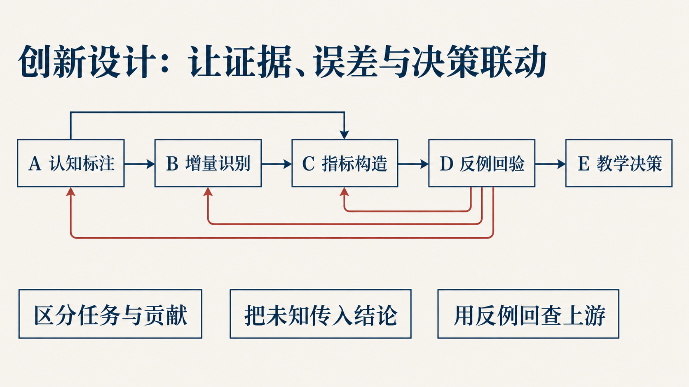

# 论文、图表与计算依据

[阅读论文 PDF](../build/paper/main.pdf) · [Markdown 全文](研究论文.md) · [五组结果解读](../docs/结果阅读指南.md) · [运行 Notebook](../notebooks/README.md)

论文围绕一个问题展开：**AI 学习记录能支持怎样的评价，教师据此能采取什么行动？** 从任务与贡献测量、比较资格、指标与条件范围出发，用反例检查结论，再回到补证与教学决策。



## 按问题阅读

| 想了解什么 | 论文入口 | 可运行或可核对的材料 |
| --- | --- | --- |
| 任务要求与已展示贡献怎样区分 | A：双维认知测量 | [六级分布与同回合配对](../results/final-analysis/fig01_dimensions.png)、Notebook 02 / 09 |
| 日志支持哪些比较 | B：比较资格与识别边界 | [未知标签范围](../results/final-analysis/fig03_unknown_labels.png)、Notebook 04 |
| 缺失证据怎样进入指标与综合评价 | C：指标性质与条件范围 | [敏感性结果](../results/final-analysis/fig05_score_sensitivity.png)、Notebook 05 |
| 多模型、人工复评与反例带来什么反馈 | D：检验与反馈 | [随机复核流程](../results/final-analysis/fig02_random_flow.png)、[人工复评](../results/final-analysis/fig04_human_pairs.png)、Notebook 03 / 06 |
| 怎样生成可行动的报告 | E：教学行动 | [Notebook 07](../notebooks/07_教育报告与复用.ipynb)、[两例合成计算](../scripts/demo_evidence_chain.py) |

早期首问与三模型流程探索、合成分配对照、复现方法和 AI 采用记录在附录中单列。[Notebook 导读](../notebooks/README.md)提供完整计算导航。

## 两张图抓住结果范围

| 真实回合的双维候选 | 缺失与扰动下的条件范围 |
| --- | --- |
|  |  |
| 3,515 个真实回合；任务候选 1,010、贡献候选 776，同回合共同候选 48。 | 356 个有任务候选的学生—学期单元；完整 AIV 可计算单元为 0，图示保守外包范围。 |

完整数值、分母、方法条件与来源哈希见 [summary.json](../results/final-analysis/summary.json)。五组图均提供 PNG / PDF / SVG，下载入口见[结果阅读指南](../docs/结果阅读指南.md)。

## 源文件地图

| 文件 | 内容 |
| --- | --- |
| [main.tex](main.tex) | 论文结构、数学定义与主体论证 |
| [final_analysis_results.tex](final_analysis_results.tex) | t3 聚合结果、表格与统计图引用 |
| [appendix_reproducibility.tex](appendix_reproducibility.tex) | 观测单位、计算方法与复现范围 |
| [appendix_ai_usage.tex](appendix_ai_usage.tex) | AI 使用、探索过程与人工采用 |
| [references.bib](references.bib) | 参考文献 |
| [figure_groups](figure_groups/) / [figure_style.tex](figure_style.tex) | 五组统计图的 LaTeX 组合与样式 |

## 编译与更新

阅读成品无需安装 TeX。编译源稿需先按 [TEMPLATE.md](TEMPLATE.md)取得固定版本 CUMCMThesis 类文件和样式，并准备 XeLaTeX / Biber、SimSun / SimHei、Times New Roman。

在已配置的仓库根目录执行：

```powershell
powershell -NoProfile -ExecutionPolicy Bypass -File scripts/build_latex.ps1 -Source paper/main.tex -OutputDirectory build/paper
```

结果段落由固定汇总生成，Markdown 阅读稿由当前 LaTeX 展开：

```powershell
.venv\Scripts\python.exe -X utf8 paper/generate_final_analysis.py --check
.venv\Scripts\python.exe -X utf8 paper/update_results.py --mirror-only
```

`--check` 核对结果段落与汇总的一致性；去掉该参数可重新生成。更新源结果后，应同步核查解释、图表、PDF 和阅读稿。图表重绘命令与字体检查见[复现说明](../docs/复现说明.md)。

<details>
<summary>核对当前结果版本与 SHA-256</summary>

主分析版本为逐回合 **t3**。固定随机复核 352 回合、高风险复核 827 回合分别报告。

| 对象 | SHA-256 |
| --- | --- |
| 冻结清单 | `7e885ceecf12a180349369ed9ddfc962ad71f1ea270f68b037a86a396430631d` |
| 最终分析 summary.json | `a181f0840a47c129aeb148f1ea5b36c5941a0943cd5fb1ebfa2acd8bfc28a64c` |

公共仓库提供聚合统计、合成演示和原创论文。逐条记录的重算需要授权输入，范围见[复现说明](../docs/复现说明.md)。

</details>
