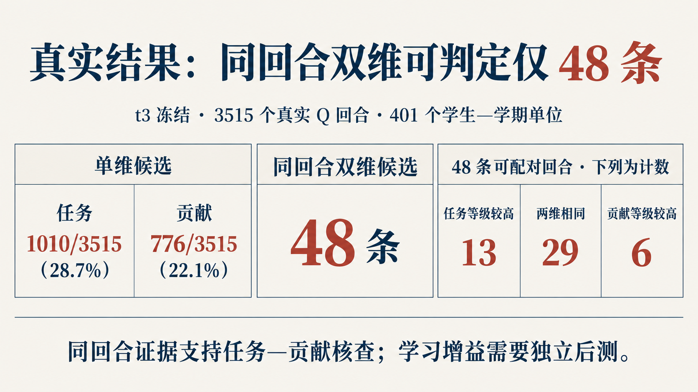
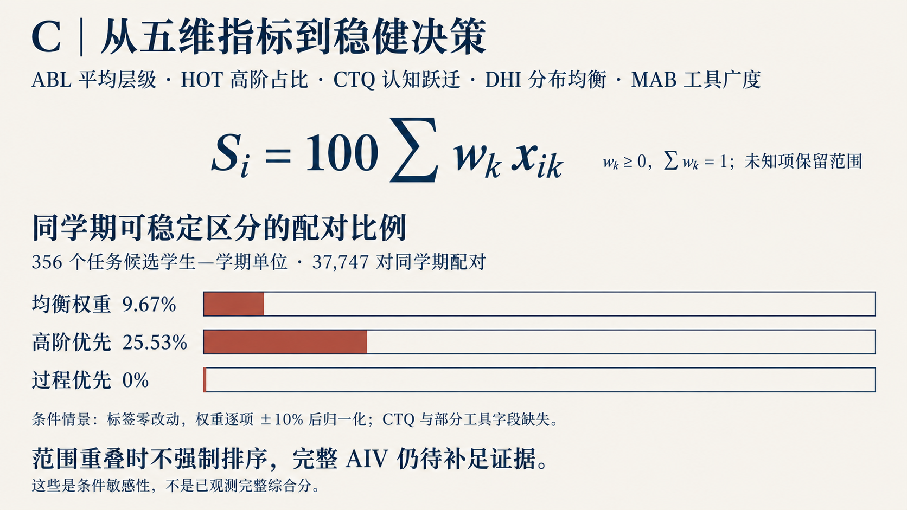
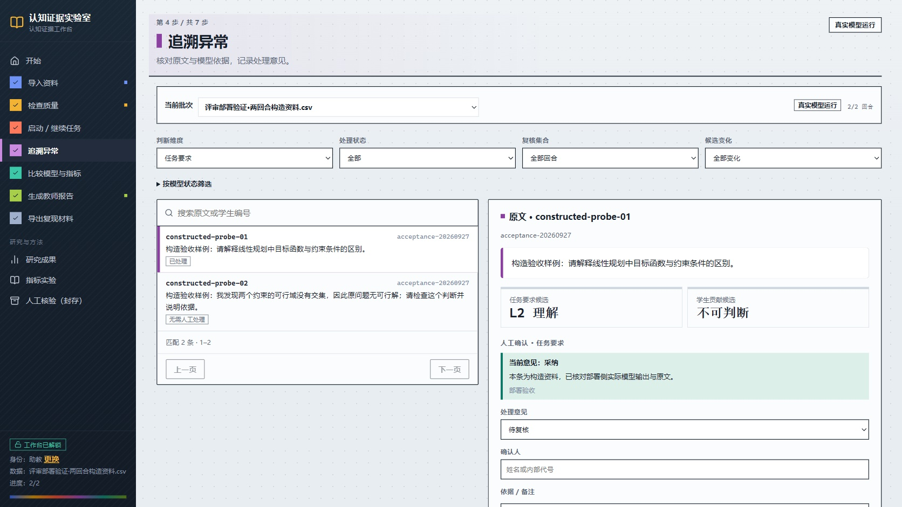

# 南行 · 20 页路演

**12 页主讲 · 7 页备答 · 1 页致谢**。主讲内容共 270 秒，另留 30 秒翻页与停顿。图页把研究方法、真实结果、合成计算和工作台交付连在一起。

[离线播放器](roadshow/player/index.html) · [五分钟讲稿](roadshow/五分钟讲稿.md) · [全套联系表](roadshow/contact-sheet.html) · [逐页来源清单](roadshow/manifest.json)

## 先看这六页

| 真实发现 · 第 05 页 | 指标与比较边界 · 第 06 页 |
| --- | --- |
|  |  |

| 完整合成证据 · 第 09 页 | 缺失证据响应 · 第 10 页 |
| --- | --- |
|  |  |

| 教师报告 · 第 11 页 | 原文与判断追溯 · 第 17 页 |
| --- | --- |
|  |  |

第 05 页来自 3,515 个真实学生回合。第 06 页报告给定标签与权重条件下的范围分析。第 09–10 页使用保存的合成标签确定性计算；第 11、17–18 页展示构造资料的部署验证，其中模型调用确实执行。各类证据分别解释，工程演示不计入真实回合统计。

## 放映与阅读

克隆或下载仓库后，使用浏览器打开 `slides/roadshow/player/index.html`。GitHub 文件页可直接看图片，HTML 播放器需在本地打开。

| 操作 | 按键 |
| --- | --- |
| 上一页 / 下一页 | 左右方向键、Page Up / Down、空格 |
| 首末页 | Home / End |
| 原图全屏 / 退出 | F / Esc |
| 浏览器全屏 | F11 |

播放器支持缩略图选页，并可跳到主讲、备答和致谢。讲稿第 08–11 页采用预备图页展示，5 分钟讲述无需等待现场运行。想自行验证两种计算，可按[复现说明](../docs/复现说明.md)运行短命令。

## 完整页序

| 页码 | 内容 | 页码 | 内容 |
| --- | --- | --- | --- |
| [01](roadshow/images/01.png) | 封面 | [11](roadshow/images/11.jpg) | 教师报告 |
| [02](roadshow/images/02.png) | 问题与使用者 | [12](roadshow/images/12.png) | 演讲结束 |
| [03](roadshow/images/03.png) | A—E 递进建模链 | [13](roadshow/images/13.png) | 备答：增量识别条件 |
| [04](roadshow/images/04.png) | 双模型标注与独立复核 | [14](roadshow/images/14.png) | 备答：任务与贡献 |
| [05](roadshow/images/05.png) | 真实逐回合双维结果 | [15](roadshow/images/15.png) | 备答：人工复评 |
| [06](roadshow/images/06.png) | 指标结果与比较边界 | [16](roadshow/images/16.png) | 备答：权重敏感性 |
| [07](roadshow/images/07.png) | 合成反例与修订 | [17](roadshow/images/17.jpg) | 备答：原文追溯 |
| [08](roadshow/images/08.png) | 工作台入口 | [18](roadshow/images/18.png) | 备答：四模型任务记录 |
| [09](roadshow/images/09.png) | 完整证据的合成计算 | [19](roadshow/images/19.png) | 备答：仓库复现 |
| [10](roadshow/images/10.png) | 缺失证据的响应 | [20](roadshow/images/20.png) | 问答致谢 |

图页来源、证据范围、讲述秒数、尺寸与 SHA-256 见 [manifest.json](roadshow/manifest.json)。编号原图保留已核验来源的原始字节；统计依据见[结果阅读指南](../docs/结果阅读指南.md)，研究全文见[论文](../paper/README.md)。
