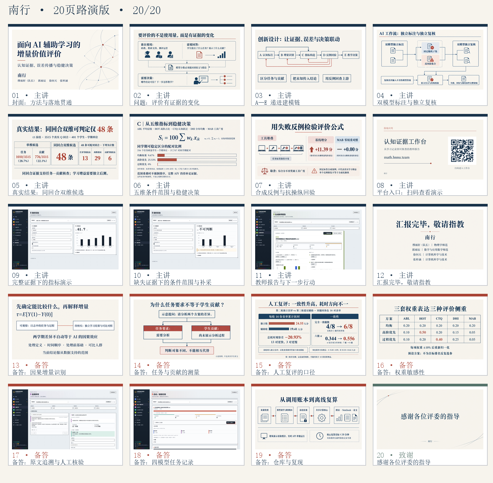

# 南行 · 20 页路演

[回到演示导读](../README.md) · [五分钟讲稿](五分钟讲稿.md) · [全部图页](contact-sheet.png) · [离线播放器](player/index.html)

12 页主讲、7 页技术备答、1 页致谢。主讲预算 270 秒，预留 30 秒翻页与口播余量。

下载仓库后打开播放器：左右方向键、Page Up/Down 或空格翻页，Home/End 到首尾；F 切换图页全屏，Esc 退出。浏览器可使用 F11；顶部入口可以直接跳到主讲、备答或致谢。

第 05 页是 3,515 个真实回合的聚合观察，第 06 页是给定缺失与扰动条件下的范围，第 07 页是合成反例。第 09–10 页使用保存的合成标签计算；第 11、17–18 页使用构造输入和工程控制，均不计入真实学生样本。

[图页清单](manifest.json)记录每页主题、证据范围和 SHA-256；[来源映射](source-map.csv)提供表格形式，原图在 `images/`。页面按窗口缩放显示，原图字节保持不变。
